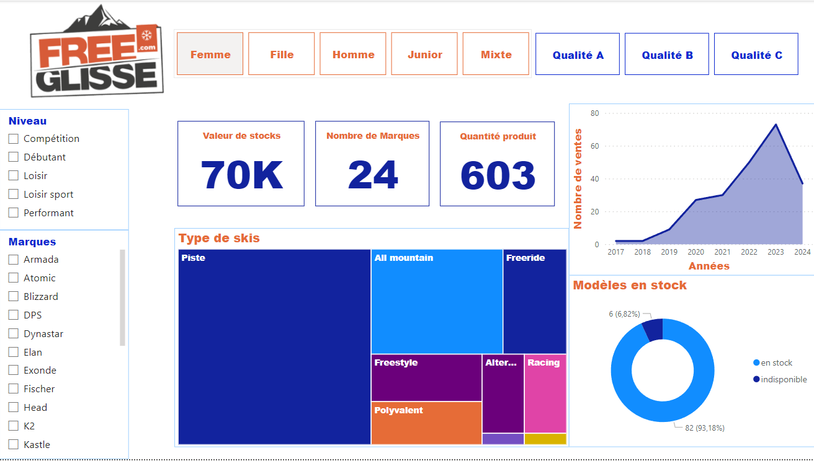
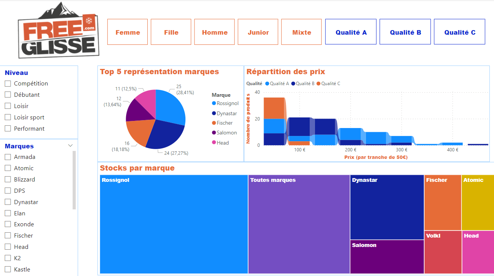
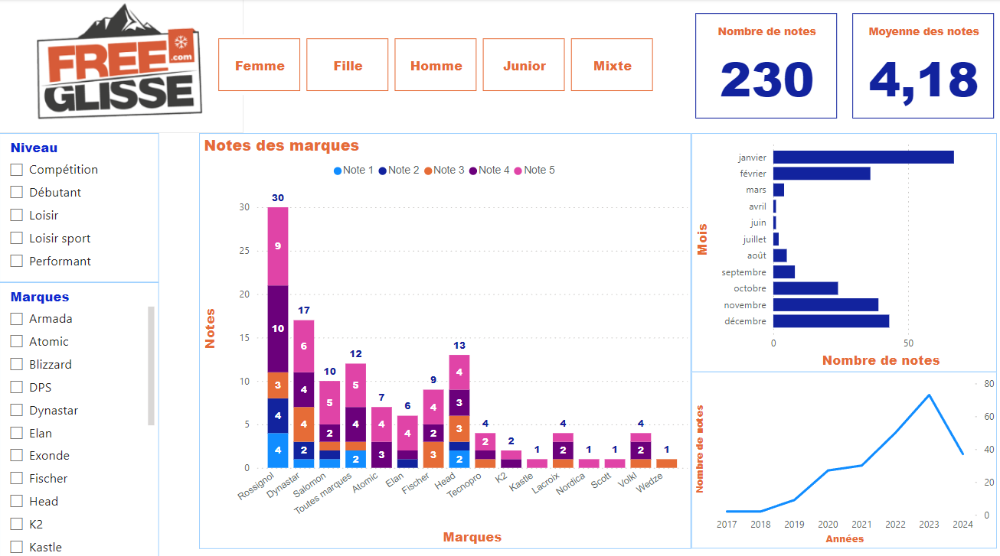
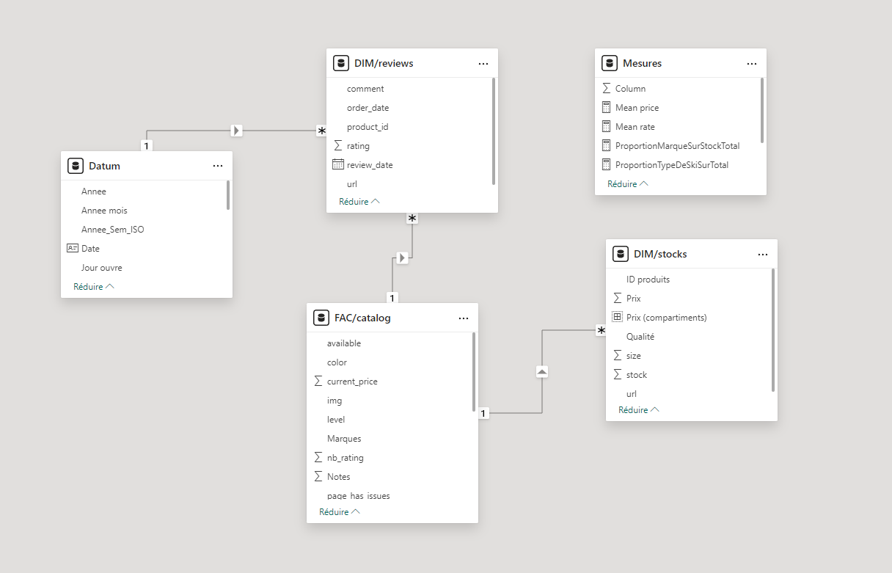

# Olist Sports Segment Analysis

## Context

Olist is expanding its offerings into the sports segment by integrating sports marketplaces into its platform. To refine its strategy with respect to sports vendors, it is imperative to analyze their offerings and market positioning. This project focuses on **FreeGlisse**, an online platform for selling used ski equipment, to gather a wealth of information displayed on its website.

## Project Objectives

- Analyze the number of ski-related listings on FreeGlisse.
- Investigate pricing strategies and distribution across various ski sub-categories.
- Assess the depth of stock for available products.
- Provide quantitative and qualitative analyses of FreeGlisse's market positioning.
- Generate insights into FreeGlisse's commercial positioning and potential unique offerings to Olist.

## Methods

Utilizing **pandas** for data manipulation and **Power BI** for visualization, this analysis dissects FreeGlisse's inventory data. Techniques included:

- **Web Crawling**: Navigation across different web pages to observe the range of used ski offers.
- **Web Scraping**: Extraction of detailed information from individual pages.
- **Data Analysis**: Employing pandas for data crunching and insights generation.
- **Visualization**: Crafting comprehensive charts and graphs using Power BI.

## Visualizations

The following Power BI screenshots showcase the analysis outcomes:
- 
- 
- 
- 

## Notebooks

- `freeglisse_main_scrap.ipynb`: Extracting all products details and ratings.
- `freeglisse_review.ipynb`: Extracting consumer reviews for each products.
- `freeglisse_stock.ipynb`: Extracting the stock of each product according to its size and quality.

## Dependencies

- Pandas
- Numpy 
- BeautifulSoup
- Requests
- Re
- Selenium
- Os
- Time

